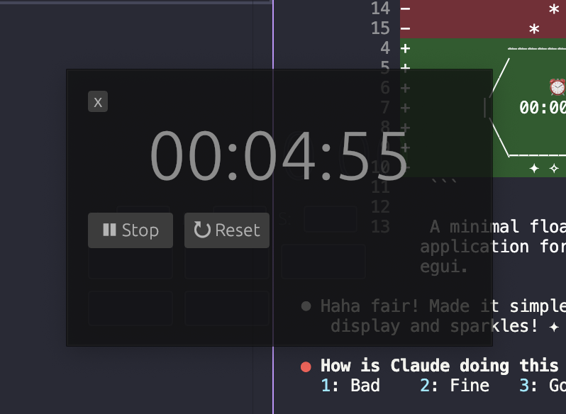

# Clock Floater



A minimal floating timer/countdown application for macOS built with Rust and egui.


> The new programming language is ENGLISH!
>
> This ENTIRE app was conjured into existence through the POWER OF WORDS!
>
> Zero. Manual. Coding.
>
> Every single line - from choosing the GUI framework, to the fireworks that LITERALLY EXPLODE when your timer hits zero, to that annoying sound that plays 100 times - was birthed from casual conversation with Claude Code!
>
> We just... *talked*... and BAM! A fully functional Rust app appeared!
>
> Shoutout to:
> - **Rust** - for being blazingly fast and memory safe (even when we don't write it ourselves)
> - **Claude** - for turning vague ideas like "make it prettier" into actual code
> - **The future of app building** - where your biggest skill is knowing how to ask for what you want
>
> The future is weird, folks. And it's AWESOME!

## Features

- **Floating Timer Display**: Always-on-top window with large, readable countdown display
- **Custom Countdown**: Set hours, minutes, and seconds
- **Quick Presets**: One-click buttons for 5, 20, and 30-minute timers
- **Visual & Audio Alerts**: Fireworks celebration effect and sound notification when countdown reaches zero
- **Draggable Window**: Click and drag anywhere to reposition
- **Minimal Design**: Frameless, transparent window with clean UI

## Installation

### From Source

```bash
git clone https://github.com/iamquang95/clock-floater
cd clock-floater
cargo install --path .
```

### From crates.io

```bash
cargo install clock-floater
```

## Usage

Run the application:

```bash
clock-floater
```

Or if built from source:

```bash
cargo run --release
```

### Controls

- **Set Time**: Enter hours, minutes, and seconds in the input fields
- **Quick Presets**: Click "5 min", "20 min", or "30 min" for instant countdown
- **Start/Stop**: Use ▶ Start and ⏸ Stop buttons to control the timer
- **Reset**: Click ↻ Reset to clear the countdown
- **Move Window**: Click and drag anywhere on the window to reposition
- **Stop Celebration**: Click anywhere during the fireworks to dismiss
- **Close**: Click the "x" button in the top left corner

## Requirements

- macOS (uses macOS system sounds for alerts)
- Rust 1.70 or later

## License

MIT OR Apache-2.0
